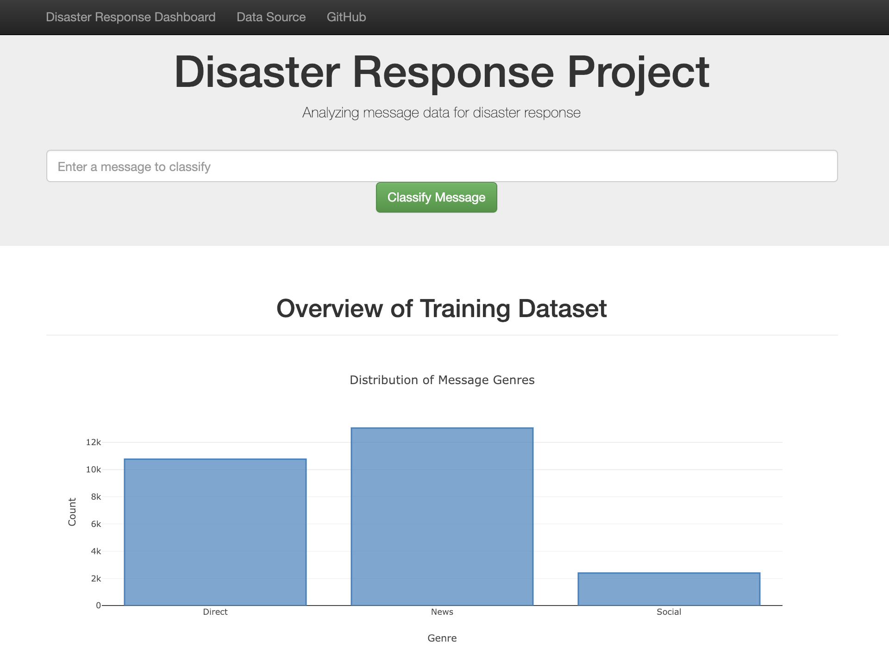
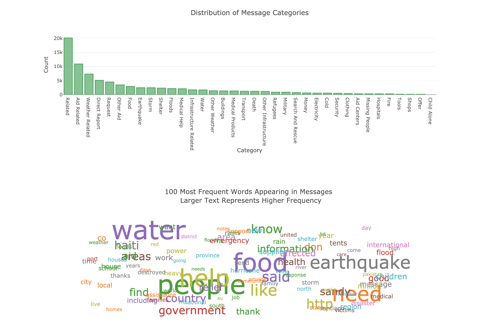
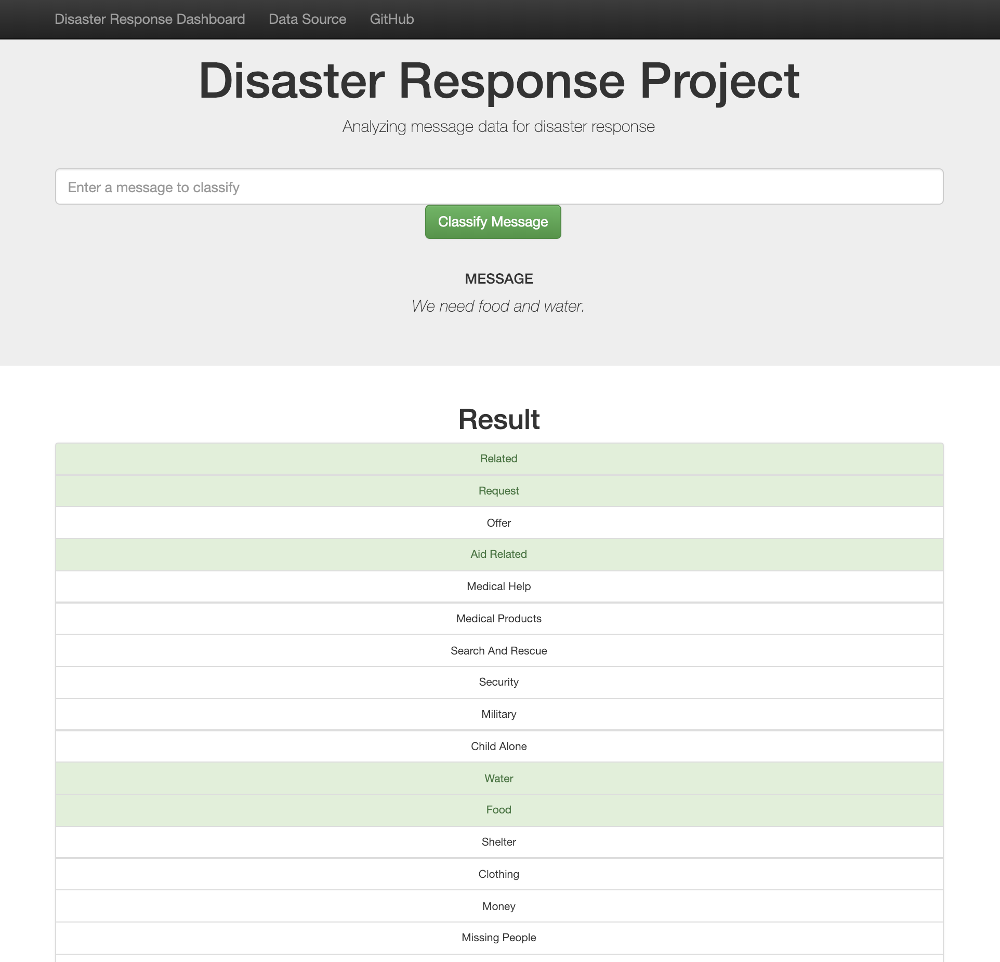

# Disaster Response

- [Disaster Response](#disaster-response)
  - [1. Background](#1-background)
  - [2. File Descriptions](#2-file-descriptions)
  - [3. Instructions](#3-instructions)
  - [4. Python version and libraries](#4-python-version-and-libraries)
  - [5. Screenshots of web application](#5-screenshots-of-web-application)

## 1. Background

This project uses natural language processing (NLP) and machine learning to classify social media messages for disaster events.

**Objectives:** (1) build a command line application that creates messages classifier based on input dataset; and (2) build a web application that visualizes the dataset and predicts categories of a new input message.

**Dataset:** The dataset of social media messages for disaster events and 36 categories was given by Udacity Nanodegree program in partner with [Figure Eight](https://www.figure-eight.com/data-for-everyone/).

## 2. File Descriptions

- `app`
  - `template`
    - `master.html`: homepage of web app
    - `go.html`: classification result page of web app
  - `run.py`: Flask file that runs web app
  - `utils.py`: customized functions and transformers that support `run.py`

- `data`
  - `disaster_categories.csv`: message categories data to process
  - `disaster_messages.csv`: messages data to process
  - `process_data.py`: ETL pipeline to clean data and store data into SQLite database
  - `ETL Pipeline Preparation.ipynb`: ETL pipeline prepared in a notebook
  - `DisasterResponse.db`: database of cleaned data

- `models`
  - `train_classifier.py`: machine learning pipeline to train a classification model and store the trained model into a pickle file
  - `ML Pipeline Preparation.ipynb`: machine learning pipeline prepared in a notebook
  - `utils.py`: customized functions and transformers that support `train_classifier.py`
  - `classifier.pkl`: pickle file of trained model

- `README.md`

## 3. Instructions

- **Command line application**

   Run the following commands in the project's root directory to set up the database and model.

    - To run ETL pipeline that cleans data and stores in database  
        `python data/process_data.py data/disaster_messages.csv data/disaster_categories.csv data/DisasterResponse.db`.
    - To run machine learning pipeline that trains classifier and saves  
        `python models/train_classifier.py data/DisasterResponse.db models/classifier.pkl`.

- **Web application**

    Run the following command in the `app` directory to launch the web app: `python run.py`.  
    Go to http://0.0.0.0:3001/.

## 4. Python version and libraries

The code was developed using the Anaconda distribution of Python version 3.6. The following dependencies were used.

`pandas`  
`sqlalchemy`  
`nltk`  
`sklearn`  
`plotly`  
`spacy` (`en_core_web_sm` and `en_core_web_lg`)  
`flask`

## 5. Screenshots of web application

- **Homepage**

    

    

- **Classification result page**

    